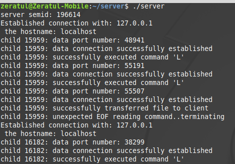
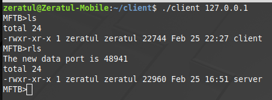

# Networked Shell
Networked Shell is a Linux shell with a number of built in utilities facilitating file exploration and file transfer 
between two computers.  It employs the client/server model.

### Server
The server runs as a daemon listening for connections on port 49999. The daemon forks a child process to handle each
connecting client and in this way can support multiple clients simultaneously.  A semaphore enforces file integrity in 
the multi-user environment.

The server logs client actions to STDOUT.

### Client
The client acts as the UI for the program, allowing the user to explore the local machine where the client resides, as 
well as the file system where the server is located. For example, the "ls" command prints the contents of the working
directory of the client process while "rls" prints the working directory on the server.

##### Connecting to the server
As seen above, provide the IP address of the server as arg1.  Defaults to port 49999

#### Commands
    "ls": Print contents of the client-side working directory
    "rls": Print contents of the server-side working directory
    "cd <dir>": Relative or absolute path. Changes client-side working directory
    "rcd <dir>": Relative or absolute path. Changes server-side working directory
    "get <file>": Downloads server-side file into the client-side working directory
    "put <file>": Uploads client-side file into the server-side working directory
    "show <file>": Pipes contents of server-side file into "more"

### Compiling
"make server" and "make client" builds both executables.